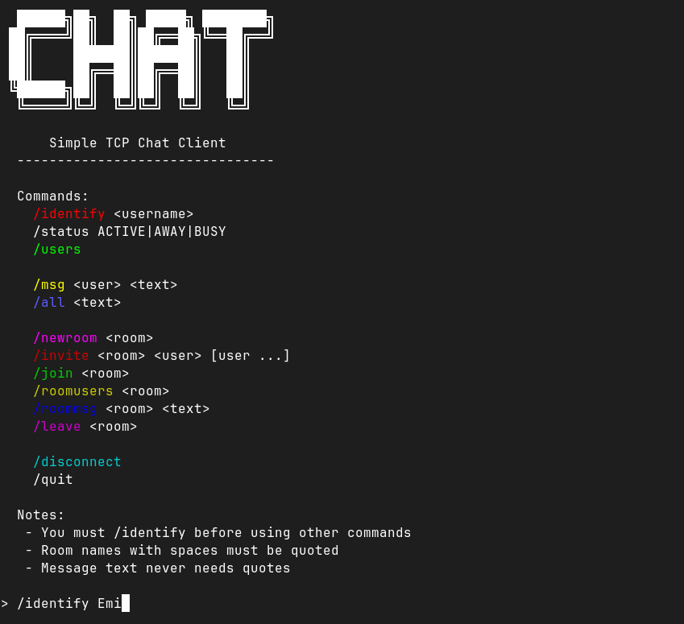

# Chat Client

Minimal terminal TCP chat client written in C.
Implements the full JSON-based protocol specified by the project, using newline (`\n`) framing, low-level sockets, and a real JSON library.

This is a **client only** implementation. 
All protocol authority (users, rooms, permissions) is handled by the server.

---

## Protocol Scope

**This client implements the protocol exactly as specified; no extensions, shortcuts, or assumptions are made.**

---

## Features

- TCP client using POSIX sockets
- JSON parsing and generation via **jansson**
- Newline (`\n`) message framing
- Interactive CLI
- Clean command parser (no JSON typing by the user)
- Prompt with username after identification
- Dockerized build and runtime
- No protocol deviations or undocumented behavior

---

## Requirements

### Recommended (Docker)
- Docker ≥ 20.x

See:
- [Docker](https://www.docker.com/get-started/).

### Manual build (not recommended)
- GNU/Linux (or compatible POSIX system)
- C compiler (GCC / Clang)
- Meson
- Ninja
- jansson development library

See:
- [Meson](https://mesonbuild.com)
- [Ninja](https://ninja-build.org)
- [Jansson](https://jansson.readthedocs.io/en/latest/)

To manual installation go to [Manual Installation](#manual-build)

---

## Build and Run

### Docker – Recommended

#### Build image
From the`chat-client` directory:

```sh
$ docker build -t chat-client:0.1.0 .
```

#### Run client

Connect to a remote server:

```sh
$ docker run --rm -it chat-client:0.1.0 <server-ip> <port>
```

Example:

```sh
$ docker run --rm -it chat-client:0.1.0 203.0.113.10 8080
```

Connect to a server running on the host (GNU/Linux):

```sh
$ docker run --rm -it --network host chat-client:0.1.0 <localhost> <port>
```

Example:

```sh
$ docker run --rm -it --network host chat-client:0.1.0 127.0.0.1 8080
```

Or (portable alternative):

```sh
$ docker run --rm -it \
--add-host=host.docker.internal:host-gateway \
chat-client:0.1.0 host.docker.internal <port>
```

### Manual build

Only use this if Docker is not available 
(I don't think that happen if it's a proper Docker installation).

#### Install dependencies

##### Debian / Ubuntu (Linux Mint, Pop!\_OS, etc.)

```sh
$ sudo apt update
$ sudo apt install build-essential meson ninja-build pkg-config libjansson-dev
```

##### Fedora (modern RHEL-like)

```sh
$ sudo dnf install -y \
gcc gcc-c++ make \
meson ninja pkg-config \
jansson-devel
```

##### RHEL / Rocky Linux / AlmaLinux

```sh
$ sudo dnf groupinstall -y "Development Tools"
$ sudo dnf install -y meson ninja pkg-config jansson-devel
```

##### Arch Linux / Manjaro

```sh
$ sudo pacman -S --needed \
base-devel meson ninja pkgconf jansson
```

##### openSUSE (Leap, Tumbleweed)

```sh
$ sudo zypper install -y \
gcc gcc-c++ make \
meson ninja pkg-config \
libjansson-devel
```

##### Alpine Linux

```sh
$ sudo apk add \
build-base meson ninja pkgconf jansson-dev
```

##### Gentoo (for masochists)

```sh
$ sudo emerge --ask \
sys-devel/gcc sys-devel/make \
dev-util/meson dev-util/ninja \
dev-util/pkgconf \
dev-libs/jansson
```

#### Build

```sh
$ meson setup build
$ meson compile -C build
```

#### Run

```sh
$ ./build/chat-client <server-ip> <port>
```

---

## Usage

When the client starts, a short help banner is printed.

You must identify first before using other commands.

### Prompt UX

Before identification:

``` txt
>
```

After succesful identification:

``` txt
@<username>:
```

### Commands

- /identify <username>
- /status ACTIVE|AWAY|BUSY
- /users
- /msg <username> <text>
- /all <text>
- /newroom <roomname>
- /invite <roomname> <user1> [user2 ...]
- /join <roomname>
- /roomusers <roomname>
- /roommsg <roomname> <text>
- /leave <roomname>
- /disconnect
- /quit
- /help


#### Identify

```txt
> /identify <username>
```

Required before any other operation, and the username max length is 8 characters and with no blanks.

Example:

```txt
> /identify Emi
```

#### Status

```txt
@<username>: /status ACTIVE
@<username>: /status AWAY
@<username>: /status BUSY
```

Change your user status.
The user's starts with an ACIVE status.

#### List Users

```txt
@<username>: /users
```

Requests the list of connected users and their statuses.

#### Private Message

```txt
@<username>: /msg <username> <text>
```

Example:

```txt
@Emi: /msg Luis Hola Luis, ¿cómo estás?
```
Remember that a username must not contain blanks.

#### Publc Message

```txt
/all <text>
```

or simply type without a command:

``` txt
¡¡Hola a todxs!!
```

Both send a public message to all connected users.

#### Create a room

``` txt
@<username>: /newroom <roomname>
```

Room name max length: 16 characters, and room names with spaces must be quoted.

Example:

``` txt
@Emi: /newroom "Sala privada 1"
```

#### Invite users to a room

``` txt
@<username>: /invite <roomname> <user1> [user2 ...]
```

Example:

``` txt
@Emi: /invite "Sala privada 1" Luis Antonio Fernando
```

#### join

``` txt
@<username>: /join <roomname>
```

Example:

``` txt
@Luis: /join "Sala privada 1"
```

#### List users in a room

``` txt
@<username>: /roomusers <roomname>
```

Example:

``` txt
@Emi: /roomusers "Sala privada 1"
```

#### Send message to a room

``` txt
@<username>: /roommsg <text>
```

Example:

``` txt
@Emi: /roommsg "Sala privada 1" Bienvenidos a la sala
```

#### Leave a room 

``` txt
@<username>: /leave <roomname>
```

Example:

``` txt
@Emi: /leave "Sala privada 1"
```

#### Disconnect cleanly

``` txt
@<username>: /disconnect
```

Sends a DISCONNECT message to the server and waits for the server to close the connection.

#### Quit client

``` txt
@<username>: /quit
```

Sends DISCONNECT (best effort), and exits the client.

#### Help

``` txt
@<username>: /help
```

Prints a short local usage guide.
This command is **client-side** only and does not contact the server.

### Running client example



## Notes

All protocol validation and authorization is handled by the server. The client intentionally does not duplicate server-side rules. JSON messages are never typed manually by the user. If the server disconnects or sends invalid data, the client exits cleanly.

---

## License

[The MIT license](../../LICENSE).

Academic project.

---

## Status

**Stable - v0.1.0**

Any issue please contact: *emiliano.arreguin@ciencias.unam.mx*
